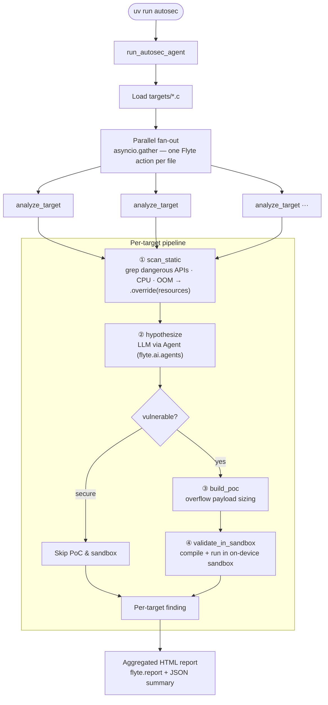

# AutoSec — autonomous security-ops researcher (demo MVP)

A deliberately minimal, **5–10 minute** slice of an "auto security ops"
researcher: a Flyte pipeline that fans out across several small C programs (each
with a planted vulnerability) **in parallel**, finds the bug in each, and
delegates the high-security proof-of-concept validation to an **on-device
user-namespace sandbox** (``unionai-sandbox``).

The point is the **orchestration story** — how Flyte makes a flaky, multi-step,
resource-heterogeneous agent pipeline *reliable* — not finding a real 0-day.
See [`SPEC.md`](./SPEC.md) for the full requirements (the demo is §11).

> **Safety.** This is a *defensive* tool that runs against bundled, authorized
> targets (`src/autosec/targets/*.c`) — some with a planted bug, some secure.
> Exploit code executes inside the on-device sandbox, never on the Flyte node.

## What it does



`run_autosec_agent` fans out over every file in `targets/` with `asyncio.gather`, so each
target is researched as its own Flyte action **in parallel**; within a target
the stages run sequentially. Targets the model judges **secure** short-circuit
after `hypothesize` (no PoC, no sandbox). The hypothesis step uses a
`flyte.ai.agents.Agent` with tools = [`scan_static`, `build_poc`, `validate_in_sandbox`].
Each stage demonstrates a
Flyte feature that a naive agent loop gets wrong (see [`SPEC.md` §11.4](./SPEC.md)):

| Problem | Flyte solution |
|---------|----------------|
| LLM API timeouts | `@env.task(retries=, timeout=)` |
| Agent hallucination / bad tool calls | checkpoint & resume (`@flyte.trace` + `@env.task`) |
| Infra failures (e.g. OOM) | user `try/except` + `.override(resources=...)` |
| Cost runaway | per-task resource limits + execution timeouts + guaranteed sandbox teardown |

## Layout

```
examples/agents/autosec/
├── pyproject.toml          # uv_build package; console script `autosec`
├── README.md               # this file
├── SPEC.md                 # full requirements spec
└── src/autosec/
    ├── demo.py             # the parallel pipeline + cli()
    └── targets/            # bundled C targets (vulnerable + secure)
        ├── stack_overflow_strcpy.c       # vuln: strcpy overflow (exploited)
        ├── sprintf_overflow.c            # vuln: unbounded sprintf (exploited)
        ├── memcpy_intoverflow.c          # vuln: unchecked memcpy length (exploited)
        ├── strcat_overflow.c             # vuln: strcat past buffer (exploited)
        ├── gated_overflow.c              # vuln but naive PoC misses it (VULNERABLE, not triggered)
        ├── safe_strncpy.c                # secure: bounded strncpy
        ├── safe_snprintf.c               # secure: size-bounded snprintf
        └── safe_bounds_checked_memcpy.c  # secure: clamped memcpy (false-positive triage)
```

## Prerequisites

- [`uv`](https://docs.astral.sh/uv/) installed.
- A configured Flyte backend (`flyte.init_from_config()` reads your
  `config.yaml`).
- An Anthropic API key (or set `AUTOSEC_MODEL` to another litellm-supported
  model).
Set the secrets/keys (the pipeline reads them from the environment, and
`pyproject.toml` declares the matching Flyte secret `anthropic-api-key` for
backend runs):

```bash
export ANTHROPIC_API_KEY=sk-...
```

## Run

From this directory (`examples/agents/autosec`):

```bash
# Console script (installs deps from pyproject.toml, then runs):
uv run autosec

# ...or run the module directly:
uv run python -m autosec.demo
```

Expected wallclock: **~5–10 minutes**, dominated by a handful of parallel LLM
calls and short sandbox runs (one per target). Output: a per-target report
with the planted bug located, a PoC, and a sandbox `exit_code`/log proving it
triggers — plus visible retry/timeout/OOM recovery in the run UI.

## Demo beats (optional)

Toggle one (or all) of these between runs to deterministically show recovery.
Each fires only on a specific task attempt, then succeeds on retry:

```bash
AUTOSEC_FORCE_LLM_TIMEOUT=1   uv run autosec   # A: hung LLM call -> timeout + retry
AUTOSEC_FORCE_BAD_TOOL_CALL=1 uv run autosec   # B: garbage JSON -> raise + resume (cached LLM call not re-billed)
AUTOSEC_FORCE_OOM=1           uv run autosec   # C: OOM -> bigger box + file-scoped fallback
AUTOSEC_FORCE_ALL=1           uv run autosec   # all three at once (beats staggered by attempt)
```

## Build the package

```bash
uv build        # produces dist/*.whl and dist/*.tar.gz via the uv build backend
```

## Out of scope (MVP)

Real fuzzing, binary analysis, kernel exploitation, the full FSM orchestrator +
journal, and multi-model routing are intentionally omitted — see
[`SPEC.md`](./SPEC.md) for the target architecture.
