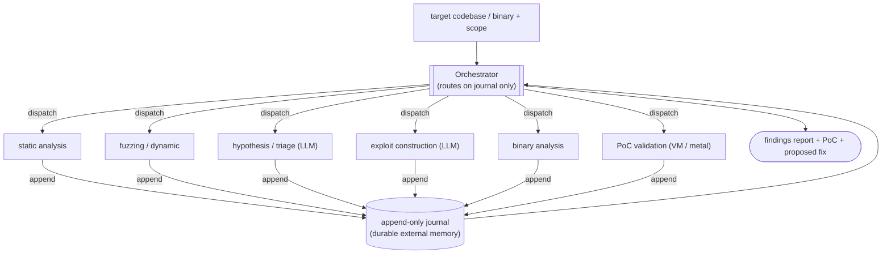
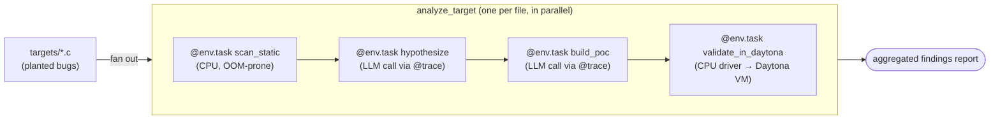

# AutoSec — Autonomous Security Operations Researcher (Spec)

This document articulates the **requirements** for an "auto security ops"
researcher: an autonomous agent system that **finds vulnerabilities** in
software and, where authorized, **constructs and validates proof-of-concept
exploits** for them.

It is a *requirements / design* spec, not an implementation. It exists to
capture what the system must do, the constraints it operates under, and why
this class of workload maps cleanly onto Flyte 2's heterogeneous,
fault-tolerant task orchestration.

> **Scope & safety.** AutoSec is a **defensive** research tool, modeled on the
> Project Glasswing framing: find and fix vulnerabilities in software *you own
> or are authorized to test* before adversaries do. Every requirement below
> assumes authorized targets, air-gapped execution of any exploit code, and a
> human-in-the-loop gate before any finding is acted on. See
> [§7 Safety & containment requirements](#7-safety--containment-requirements).

---

## 1. Mission

Given a **target codebase or binary** and an authorization scope, AutoSec must:

1. **Discover** plausible vulnerabilities (memory corruption, logic flaws,
  integer overflows, use-after-free, injection, auth bypass, …).
2. **Validate by execution** — confirm reachability and triggerability with an
  executable harness rather than relying on static analysis alone.
3. **Construct** a proof-of-concept exploit (where in scope), up to and
  including chained primitives, in an isolated environment.
4. **Report** findings with empirical evidence: the trigger input, the crash /
  corruption signature, the analysis chain, severity, and a proposed fix.

The **primary value is in discovery and a reproducible PoC** — the defensive
use case. End-to-end weaponization is explicitly *optional* and gated.

### Design premise

The motivating observation (from replication work on frontier
vulnerability-research models) is that **the discovery step is largely a
commodity model capability today**, reproducible with smaller and open-weight
models *under the right orchestration harness*. The differentiating layer is
**robust, fault-tolerant, resource-heterogeneous orchestration** — exactly
Flyte's wheelhouse. AutoSec is therefore designed as an **infrastructure
problem first, model problem second**.

---

## 2. Architecture requirements

AutoSec MUST implement a **finite-state-machine (FSM) orchestration** with the
following components.

### 2.1 Orchestrator (strategic router)

- A central **Orchestrator** agent decides which specialized agent to dispatch
next.
- The Orchestrator **MUST NOT** read target source directly; it routes based
**only** on the execution journal (§2.2). This keeps its context small and
its decisions auditable.
- It runs the investigation until it emits a final **vulnerability findings
report**.

### 2.2 Append-only journal (durable external memory)

- The system MUST maintain an **append-only journal** as its source of truth:
hypotheses, agent dispatches, harness outputs, coverage reports, crash
artifacts, diffs, and prior decisions.
- Specialized agents **start with fresh context windows** and rehydrate the
relevant *slice* of state from the journal. Long research **MUST NOT** depend
on a single swollen context window.
- Journal writes MUST be **atomic and checksummed** (write-ahead-log
discipline). A worker killed mid-write MUST NOT leave the Orchestrator
reading corrupt state. See failure mode [§6.7](#67-stale-or-partial-journal-state).

### 2.3 Hypothesis → execution discipline

- Every state transition follows: **hypothesize statically, validate by
execution.**
- A PoC is an **executable harness** that triggers the bug to prove
reachability and surface memory corruption — empirical evidence beyond static
analysis.

### 2.4 Specialized sub-agents

Rather than one model doing everything, AutoSec dispatches purpose-specific
agents, each seeded from the journal with a clean context window:


| Sub-agent            | Job                                                                   | Dominant compute profile                               |
| -------------------- | --------------------------------------------------------------------- | ------------------------------------------------------ |
| Static analysis      | Code parsing, dataflow, call-graph / PDG construction (Joern, CodeQL) | CPU-bound, high RAM                                    |
| Fuzzing / dynamic    | AFL++, libFuzzer, syzkaller                                           | High CPU core count, fast ephemeral disk, long-running |
| Hypothesis / triage  | LLM reasoning over journal slices                                     | LLM inference (API or local GPU)                       |
| Exploit construction | ROP chains, heap sprays, defense bypass                               | LLM inference + iterative execution                    |
| Binary analysis      | Ghidra, Binary Ninja, angr                                            | Very high RAM (64GB+ spikes)                           |
| PoC validation       | Run exploit against target / kernel VM                                | Nested virt or bare metal                              |


### 2.5 Containerized, capability-aware execution

- The system MUST be able to **launch containers and execute target code
autonomously** — it does not just suggest, it acts.
- Each task MUST declare its compute profile so the scheduler can route it (see
§3). Kernel/VM validation MUST be routed only to nodes that advertise the
required capability (nested virt / bare metal).




---

## 3. Heterogeneous compute requirements

A single `docker run` on a homogeneous cluster is **not** an acceptable model.
Each step has a radically different compute profile, and the scheduler MUST
match each step to the right hardware.


| Step                           | CPU        | Memory                          | GPU       | Disk                                       | Special                                   |
| ------------------------------ | ---------- | ------------------------------- | --------- | ------------------------------------------ | ----------------------------------------- |
| Static analysis (Joern/CodeQL) | high       | 10–40 GB+ for large C codebases | none      | moderate                                   | graceful fallback to file-scoped analysis |
| Fuzzing (AFL++/syzkaller)      | many cores | moderate                        | none      | large, fast ephemeral, corpus minimization | hours–days, embarrassingly parallel       |
| LLM inference (local)          | moderate   | moderate                        | high VRAM | moderate                                   | model-by-task routing (§5)                |
| LLM inference (API)            | low        | low                             | none      | low                                        | just HTTP; scaffold still runs on CPU     |
| Binary analysis (Ghidra/angr)  | high       | 64 GB+ spikes                   | none      | moderate                                   | parallelize across cheaper instances      |
| PoC / kernel validation        | moderate   | moderate                        | none      | snapshot space                             | **nested virt or bare metal required**    |


**Requirement:** task-aware, **capability-aware** scheduling. Resource
requirements and accelerators are declared per task, and the orchestrator can
**retry with a different resource profile** when a step fails.

---

## 4. Functional requirements

- **FR-1 Targets.** Accept a containerized target (source tree and/or binary)
plus an explicit authorization scope.
- **FR-2 Discovery.** Produce ranked vulnerability hypotheses with location,
class, and reasoning chain.
- **FR-3 Reachability.** For each accepted hypothesis, produce an executable
trigger that demonstrates reachability.
- **FR-4 PoC (gated).** When in scope and approved, construct a PoC that
surfaces the corruption / control-flow primitive.
- **FR-5 Severity & fix.** Assign severity and propose a concrete patch.
- **FR-6 Report.** Emit a structured, auditable findings report backed by
on-disk artifacts referenced from the journal.
- **FR-7 Resumability.** A run interrupted at any state MUST resume from the
journal without re-doing completed, validated work.
- **FR-8 Human gate.** No finding is escalated or weaponized without explicit
human approval (HITL).

---

## 5. Model-routing requirements (the "jagged frontier")

Replication studies show **no stable model ranking**: a model that nails one
target (e.g., Opus 4.6 reproducing the FreeBSD bug 3/3) misses another (GPT-5.4
0/3 on the same), and small open-weight models (GPT-OSS-20b at 3.6B active,
Qwen3-32B, GLM-5.1, Kimi K2.5) are surprisingly strong on discrete discovery
tasks while uneven elsewhere.

Therefore:

- **MR-1** AutoSec MUST be **model-agnostic by construction.** No step may hard
depend on a single proprietary model.
- **MR-2** Model selection is a **per-task-type routing decision**, not a
global constant. Static analysis, false-positive triage, exploit
construction, and binary analysis may each prefer different models.
- **MR-3** Support mixing **API models and local open-weight models** in one
pipeline; cost/latency/capability trade-offs are routing inputs.
- **MR-4** A step that fails or low-confidences on one model SHOULD be
re-attempted on an alternative model (ensemble / best-of-N) before giving up.

---

## 6. Infrastructure failure modes (MUST be handled, not silently absorbed)

These are endemic to this workload and have been observed in real replication
runs. Each one needs an **explicit FSM edge**, not a silent hang or a falsely
confident report.

### 6.1 OOM (out of memory)

Most common failure. CodeQL/Joern/Ghidra OOM mid-graph and often produce a
**partial or empty** result rather than crashing cleanly — the LLM then halts
or hallucinates. **Requirement:** per-task-type memory limits, OOM detection,
**retry with a larger memory profile**, and a **graceful fallback** to
file-scoped analysis.

### 6.2 Disk exhaustion

Fuzzing corpora and VM snapshots fill disk in hours. Because the journal *is*
the system's memory, a full disk corrupts session state. **Requirement:**
generous, monitored ephemeral disk per fuzzing/VM task, corpus minimization,
and artifact offload to object storage.

### 6.3 Nested-virtualization unavailability

Observed in the wild: a PoC validation scheduled on a node without nested virt
**silently falls back to static-only**, yielding a report claiming
exploitability with no empirical confirmation. **Requirement:**
**capability-aware scheduling** — route kernel/VM validation only to
nested-virt-capable or bare-metal nodes; fail loudly otherwise.

### 6.4 GPU OOM during local inference

Fragmented VRAM from a prior task can fail inference **mid-generation** (e.g.
halfway through a ROP chain) — partial output is worse than none.
**Requirement:** isolate GPU tasks, declare VRAM needs, retry cleanly on a
fresh accelerator.

### 6.5 Timeout / wallclock exhaustion

Fuzzing and symbolic execution are unbounded in the worst case. **Requirement:**
strict per-task SLAs; on timeout the Orchestrator decides via explicit edges —
retry with a new seed, skip fuzzing, or escalate to a human.

### 6.6 Network-isolation violations

A PoC that fires inside a container MUST NOT be able to beacon out. An
unrestricted runtime + a reverse-shell payload = an accidentally live exploit.
**Requirement:** air-gapped / strictly egress-controlled PoC execution. See §7.

### 6.7 Stale or partial journal state

A worker killed mid-write leaves corrupt state; the next agent loops, halts, or
hallucinates. **Requirement:** atomic, checksummed, write-ahead-log-style
journal writes; readers validate before rehydrating.

---

## 7. Safety & containment requirements

- **SR-1** Authorized targets only; scope is a required input and is enforced.
- **SR-2** All exploit code executes **air-gapped** (no outbound network);
egress is denied by default at the runtime, not just by convention.
- **SR-3** Agentic actions are treated as an **independent threat surface** —
the Orchestrator's goal-directed behavior is constrained and bounded
(no open-ended "do whatever it takes" objectives).
- **SR-4** **HITL approval** gates any escalation, disclosure, or weaponization
step.
- **SR-5** Full audit trail: every dispatch, hypothesis, and execution is
recorded immutably in the journal.

---

## 8. Why this maps to Flyte 2

The FSM + Orchestrator + specialized-agents pattern is, almost line for line, a
Flyte 2 workflow:

- **Each sub-agent is a typed `@env.task`** with declared
`Resources(cpu=..., memory=..., gpu=..., disk=...)`. The heterogeneous compute
table in §3 becomes per-task resource declarations.
- **The journal** is a durable artifact: a `flyte.io.Dir` (transcript +
path-addressed artifacts) or object storage referenced by hash — matching the
agent harness's existing memory model.
- **FSM transitions** are dynamic workflows / conditional branches driven by
the Orchestrator task.
- **OOM and timeout recovery** use native task **retries with overridden
resource profiles** (`task.override(resources=...)`) — the §6 failure modes
become retry/fallback edges instead of silent hangs.
- **Nested-virt / GPU routing** uses node selectors / accelerator requests and
capability-aware scheduling (§6.3, §6.4).
- **Unbounded fuzzing** is bounded by task- and workflow-level **timeouts**
(§6.5).
- **Air-gapped execution** uses isolated task environments with egress denied
(§7).
- **Model-agnostic routing** (§5) is just choosing which model a given task
calls — trivially expressible when each step is its own task. The agent
harness already supports plain-fn, `@flyte.trace`, `@env.task`, `LazyEntity`,
and MCP tools, plus local or API LLM backends.
- **HITL** (§7, FR-8) uses the existing human-approval gating
(`flyteplugins-hitl`).

In short: the **model is increasingly a commodity**; the durable, fault
tolerant, resource-heterogeneous **orchestration** is the differentiator, and
that is precisely what Flyte 2 provides.

---

## 9. Out of scope (for the first iteration)

- Operationalizing or distributing weaponized exploits.
- Targeting systems outside the provided authorization scope.
- Fully autonomous disclosure without a human gate.
- A specific model leaderboard — AutoSec is model-agnostic by design; routing
policy is configuration, not a hard dependency.

---

## 10. Acceptance criteria (illustrative)

- Given a containerized C target with a known planted bug, AutoSec
discovers it and produces an **executable trigger** validated by
execution (not static-only).
- A forced OOM in static analysis results in a **retry at higher memory**
and/or a **file-scoped fallback**, never a falsely confident report.
- A PoC validation task scheduled without nested virt **fails loudly** and
is rerouted, rather than silently degrading to static-only.
- Killing a worker mid-run leaves the journal **resumable**; the run
continues without redoing validated work.
- The same pipeline runs end-to-end with **two different model backends**
(one API, one open-weight) by changing routing config only.
- No exploit task can make an outbound network connection.

---

## 11. Demo MVP

A deliberately **minimal, runnable** slice of the full system, sized for a
**5–10 minute live demo**. The point is not to discover a real 0-day; it is to
show the **orchestration story** — how Flyte makes a flaky, multi-step,
resource-heterogeneous agent pipeline *reliable* — and to show the
high-security VM step delegated to **Daytona**.

### 11.1 What the demo does

Point AutoSec at a **directory of small bundled C files** (no network fetch,
ships with the example) — some with a planted memory-corruption bug, some
secure (bounded copies / false-positive triage cases). `main` fans out over the
targets and analyzes them **in parallel**; vulnerable targets run all four
stages and contribute a Daytona-validated verdict, while targets judged secure
short-circuit after `hypothesize` (no PoC, no VM). The aggregated findings
report classifies each target as exploited / vulnerable / secure.



The stages are plain Flyte tasks in one file; the per-target `analyze_target`
tasks run concurrently via `asyncio.gather`, and the LLM sub-steps are
`@flyte.trace` helpers so they checkpoint independently of the task.

### 11.2 File layout

Packaged as an installable `uv_build` project (`pyproject.toml`) with a `src`
layout, exposing an `autosec` console script:

| Path | Role |
|------|------|
| `pyproject.toml` | Package metadata + `uv_build` backend; `autosec = autosec.demo:cli`. |
| `src/autosec/demo.py` | The pipeline tasks (`scan_static`, `hypothesize`, `build_poc`, `validate_in_daytona`), the per-target `analyze_target`, the `main` fan-out workflow + `cli()`. |
| `src/autosec/targets/*.c` | Small C files spanning all three report states: exploited (strcpy / sprintf / memcpy / strcat overflows), vulnerable-but-PoC-resistant (a reachability-gated overflow the naive PoC misses), and secure (bounded strncpy / snprintf / clamped memcpy). Shipped inside the package and bundled via `include`. |
| `SPEC.md` | This document (also the package `readme`). |

### 11.3 Pipeline skeleton

```python
import flyte
from flyte.ai.agents import Agent  # or a thin litellm call

env = flyte.TaskEnvironment(
    name="autosec-demo",
    image=flyte.Image.from_debian_base().with_pip_packages("litellm", "daytona"),
    resources=flyte.Resources(cpu=1, memory="1Gi"),
    secrets=[
        flyte.Secret(key="anthropic-api-key", as_env_var="ANTHROPIC_API_KEY"),
        flyte.Secret(key="daytona-api-key", as_env_var="DAYTONA_API_KEY"),
    ],
)


@flyte.trace  # checkpoint boundary: memoized on resume (see 11.4-B)
async def call_llm(prompt: str) -> str:
    ...  # litellm call to the routed model


@env.task(retries=3, timeout=60)  # 11.4-A: API flakiness
async def hypothesize(source: str, static_findings: str) -> dict:
    raw = await call_llm(f"Given {static_findings}, locate the overflow...")
    return _parse_or_raise(raw)  # bad/hallucinated output -> raise -> retry/resume


@env.task(retries=2, timeout=120)
async def scan_static(source: str, scope: str = "whole") -> str:
    try:
        return run_program_analysis(source, scope)          # memory-hungry
    except MemoryError:
        # 11.4-C: infra-level failure -> bigger box, narrower scope
        bigger = scan_static.override(resources=flyte.Resources(cpu=2, memory="4Gi"))
        return await bigger(source, scope="file")           # graceful fallback


@env.task(retries=2, timeout=300)  # 11.4-D: hard cost ceiling on the VM step
async def validate_in_daytona(poc: str) -> dict:
    from daytona import Daytona, DaytonaConfig
    daytona = Daytona(DaytonaConfig(api_key=os.environ["DAYTONA_API_KEY"]))
    sandbox = daytona.create()
    try:
        resp = sandbox.process.code_run(poc)                # runs in the VM
        return {"exit_code": resp.exit_code, "log": resp.result}
    finally:
        sandbox.delete()                                    # VD-5 guaranteed teardown


@env.task
async def analyze_target(name: str, source: str) -> dict:
    findings = await scan_static(source)
    hyp = await hypothesize(source, findings)
    poc = await build_poc(source, hyp)
    verdict = await validate_in_daytona(poc)
    return {"target": name, "hypothesis": hyp, "verdict": verdict}


@env.task
async def main() -> dict:
    targets = {p.name: p.read_text() for p in (HERE / "targets").glob("*.c")}
    # Fan out: one analyze_target action per file, researched in parallel.
    findings = await asyncio.gather(*(analyze_target(n, s) for n, s in targets.items()))
    return {"targets_analyzed": len(findings), "findings": list(findings)}
```

> The Daytona instance is provisioned **separately** (the user's existing
> sandbox); the demo only needs the `DAYTONA_API_KEY` secret. Daytona is the
> §2.6 "external VM SaaS provider" for this MVP — the high-security exploit
> code runs in the Daytona VM, never on the Flyte node.

### 11.4 Key problem → solution mappings (the demo's whole point)

Each mapping is something a naive `while True:` agent loop gets wrong and Flyte
gets right with one declarative knob.

**A. LLM API timeouts → `retries` + `timeout`**
LLM endpoints rate-limit, 503, and hang. The naive loop stalls forever or dies.
In the demo, `@env.task(retries=3, timeout=60)` bounds every model-backed step:
a hung call is killed at 60s and **retried** (with backoff via `RetryStrategy`).
*Demo beat:* set `ANTHROPIC_API_KEY` to a throttled key (or inject a sleep) and
show the task time out and recover instead of hanging the pipeline.

**B. Agent hallucination / bad tool calls → checkpoint & resume (`@flyte.trace` + `@env.task`)**
When the model emits malformed JSON or an invalid tool call, `hypothesize`
**raises**, and Flyte resumes from the **last good state** rather than from
scratch. Because `call_llm` is `@flyte.trace`-wrapped, **already-successful LLM
calls are memoized** — on resume they are *not* re-billed or re-run; only the
failed step re-executes. `scan_static`'s expensive output is likewise durable
across the retry. *Demo beat:* force `hypothesize` to fail once; show the rerun
skip `scan_static` and the prior good `call_llm`, picking up mid-pipeline.

**C. Infra-level failures (e.g. OOM) → user `try/except` + infra overrides**
`scan_static` runs whole-program analysis that can OOM. Instead of a silent
partial graph, the demo **catches `MemoryError`** and re-dispatches the *same
task* with `.override(resources=flyte.Resources(cpu=2, memory="4Gi"))` and a
narrower `file` scope — Flyte lets user code change the **infra profile** of a
retry. *Demo beat:* start at `memory="256Mi"`, watch the OOM, then the
auto-escalated rerun succeed.

**D. Cost runaway → resource limits + execution timeouts**
An unbounded agent can burn money forever (looping LLM calls, a stuck fuzzer, a
leaked VM). The demo caps it three ways: per-task `resources` (no surprise
64GB box), per-task `timeout` (the Daytona step is hard-killed at 300s), and a
`finally: sandbox.delete()` that **guarantees VM teardown** even on failure or
timeout (VD-5). A workflow-level timeout bounds the whole run. *Demo beat:*
point at the timeout + teardown and note the run can't exceed a known
worst-case cost.

### 11.5 Running it

```bash
# Daytona sandbox + keys configured separately by the user
export ANTHROPIC_API_KEY=sk-...
export DAYTONA_API_KEY=dtn-...

cd examples/agents/autosec

# Run via the installed console script (resolves deps from pyproject.toml):
uv run autosec

# ...or run the module directly:
uv run python -m autosec.demo
```

Expected wallclock: **~5–10 minutes**, dominated by a handful of LLM calls and
one short Daytona VM run. Output: the planted overflow located, a PoC, and a
Daytona `exit_code`/log proving it triggers — plus visible retry/timeout/OOM
recovery in the run UI.

### 11.6 Explicitly out of scope for the MVP

- Real fuzzing, binary analysis, or kernel exploitation (stubbed/omitted).
- The full FSM Orchestrator + journal (the demo is a linear 4-task pipeline;
  §2 remains the target architecture).
- Multi-model routing (one model is fine for the demo; §5 is future work).
- Any non-bundled or unauthorized target.

