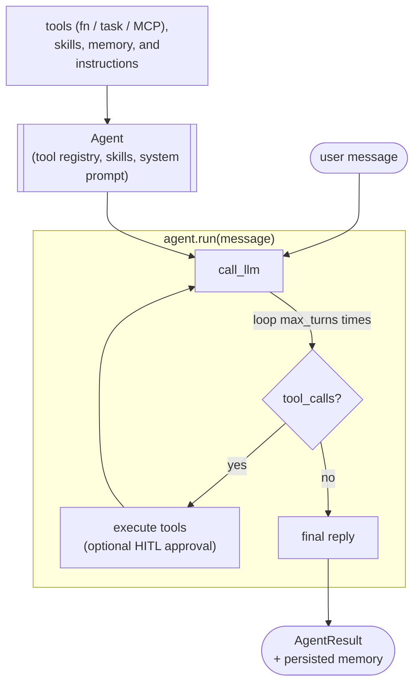

# `flyte.ai.agents.Agent` examples

This directory walks through the main use cases of
[`flyte.ai.agents.Agent`](../../../src/flyte/ai/agents/agent.py) — a
flyte-native agent harness that operates a simple, deterministic tool-use loop
on top of any LLM that speaks the OpenAI tool-calling protocol (via
[`litellm`](https://github.com/BerriAI/litellm) by default).

The harness deeply integrates with Flyte 2:

- **Tools** can be plain Python callables, `@flyte.trace` helpers,
  `@env.task` durable tasks, `LazyEntity` remote-task references, or
  pre-built `AgentTool` instances.
- **MCP servers** (Slack, GitHub, Linear, filesystem, …) are first-class:
  pass `MCPServerSpec(url=...)` or `MCPServerSpec(command=[...])` and their
  tools are loaded into the catalog automatically.
- **Memory** persists across runs via `flyte.io.Dir` (transcript +
  path-addressed artifacts, with opt-in audit log, read-only prefixes, and
  optimistic concurrency).
- **Triggers** wake the agent on a schedule (cron, fixed-rate) or via a
  webhook.
- **HITL** support pauses the loop and asks a human via
  `flyteplugins-hitl` before sensitive tools execute.

## How it works

`Agent(...)` collapses heterogeneous tool sources into a single registry +
system prompt; `agent.run(message)` then drives an LLM ↔ tool-call loop
until the model returns a plain text reply (or `max_turns` is reached):



Every step also emits a typed `AgentEvent` via `agent_progress_cb`, which
the chat UI, webhook handlers, and structured loggers subscribe to.

## Layout

| File | What it shows |
|------|---------------|
| `basic_agent.py` | Minimal agent — plain async tools, run locally from the CLI. |
| `scheduled_triage_agent.py` | Agent that wakes daily via `flyte.Cron`, uses durable Flyte tasks. |
| `agent_with_memory.py` | Persist `MemoryStore` (transcript + artifacts) to `flyte.io.Dir` between task invocations. |
| `hitl_approval_agent.py` | Gate sensitive tools behind human approval (`flyteplugins-hitl`). |
| `agent_chat_ui.py` | Wrap an `Agent` in the built-in `AgentChatAppEnvironment` UI. |
| `mcp_powered_agent.py` | Mix local Flyte task tools with remote MCP servers. |
| `webhook_agent.py` | Trigger an agent run from an HTTP webhook (e.g. GitHub events). |

## Quick start

```bash
export ANTHROPIC_API_KEY=sk-...
uv run python examples/agents/flyte_agent/basic_agent.py \
  "What is 17 * 23 plus the temperature in NYC?"
```

To deploy a scheduled or webhook-driven agent:

```bash
flyte deploy examples/agents/flyte_agent/scheduled_triage_agent.py
flyte deploy examples/agents/flyte_agent/webhook_agent.py
```

## Authoring guide

Defining an `Agent` typically looks like this:

```python
import flyte
from flyte.ai.agents import Agent

env = flyte.TaskEnvironment(name="my-agent", image="auto")


@env.task
async def list_open_tickets() -> list[dict]:
    """Pull open tickets from your tracker."""
    ...


@flyte.trace
async def summarize(items: list[dict]) -> str:
    """LLM-light summarization helper."""
    ...


agent = Agent(
    name="ticket-shepherd",
    instructions="You triage support tickets and post a daily digest.",
    tools=[list_open_tickets, summarize],
    skills=["TICKETING_HANDBOOK.md"],   # adds context to the system prompt
    max_turns=20,
)


@env.task(triggers=flyte.Trigger.daily())
async def daily_run() -> str:
    result = await agent.run("Post the digest to #support.")
    return result.summary or result.error
```

See the individual example files for the full annotated source.
