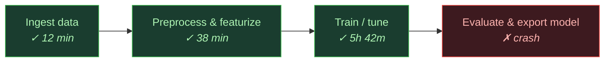
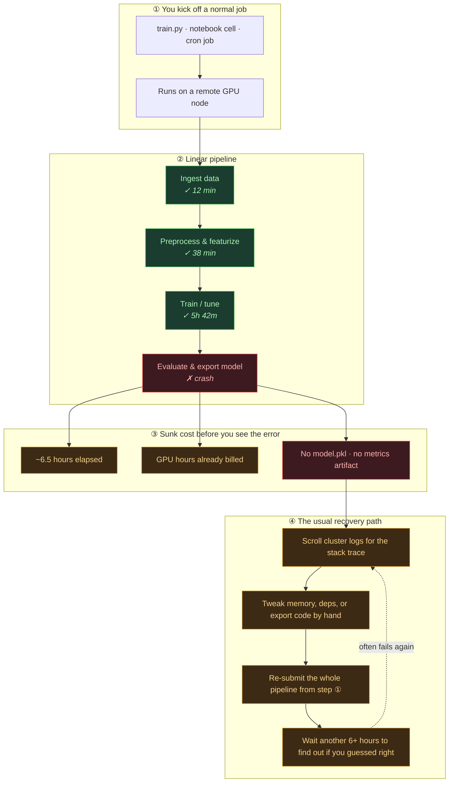

# MLE Agent

These examples demonstrate how to build a self-healing ML engineer agent using
Flyte.

## The problem: a vanilla ML job with no safety net

Most training pipelines are a single script or notebook cell: linear stages, no
checkpointing, and failure only surfaces at the end. You eat the full wall-clock
and compute bill before you learn anything went wrong.

Classic solutions to this:
- ↪️ Automatic retries with exponential backoff for intermittent failures
- 🎒 Caching to avoid re-running previous successful steps
- 🐛 Manual debugging with logs and stack traces

## Agentic self-healing

### Examples in this directory

| Script | Sandbox | What it demonstrates |
| --- | --- | --- |
| `mle_pipeline.py` | `TaskEnvironment` | Vanilla linear pipeline above — ingest → preprocess → train succeed; export crashes |
| `mle_tool_builder_agent.py` | `TaskEnvironment` training sub-jobs | Agent writes its own training code; OOM and code errors trigger resource tuning and rewrites |
| `mle_tool_builder_agent_interactive.py` | `union.sandbox` (interactive session) | Same loop, using a live multi-turn sandbox |
| `mle_orchestrator_agent.py` | Monty orchestration sandbox | Agent composes pre-defined Flyte tools into a pipeline |
| `mle_orchestrator_agent_interactive.py` | `union.sandbox` (interactive session) | Same orchestration loop in an interactive sandbox |
| `agent_launcher_app.py` | — | Web UI to launch either agent and watch runs |
