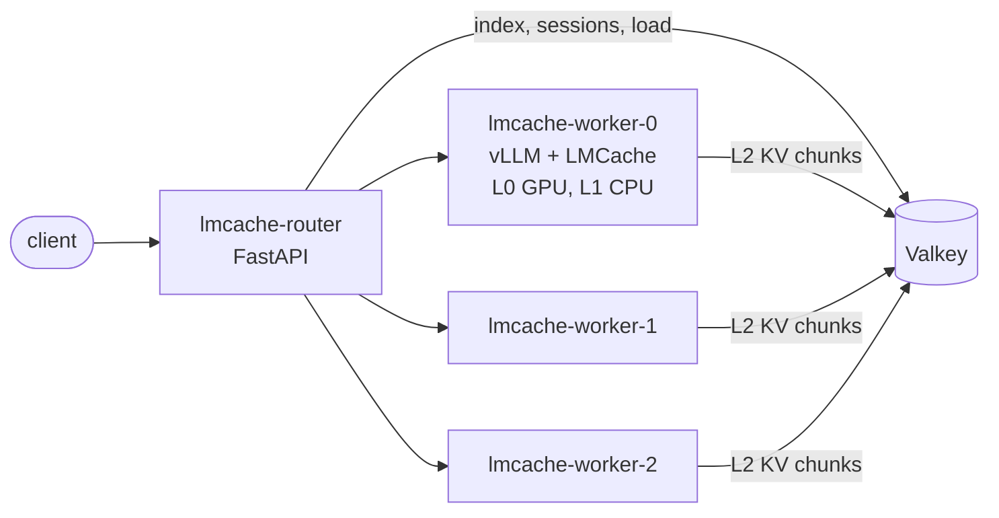

# vLLM with a tiered KV cache (LMCache + Valkey) and prefix-aware routing

This example serves a model on several vLLM workers that share KV cache through LMCache, with a router in front that sends each request to the worker most likely to hold its prompt prefix.

| Tier | Where | Shared? |
| --- | --- | --- |
| L0 | GPU memory (vLLM prefix cache) | no, per worker |
| L1 | pinned CPU memory (LMCache `local_cpu`) | no, per worker |
| L2 | Valkey (LMCache remote backend) | yes, all workers |

A request that reaches a worker without its prefix in L0/L1 still reads it from L2 instead of recomputing it. The router's job is to keep hits in L0/L1 where it can, so it can afford to be approximate. It keeps its own state in the same Valkey:

- **Sticky sessions.** `x-session-id` header, or the OpenAI `user` field → the same worker.
- **Prefix-aware routing.** The router hashes the prompt in 256-token blocks (the LMCache chunk size) and remembers which worker last served each block. A new request goes to the worker holding the longest matching prefix.
- **Load-aware spill-over.** A session or prefix owner is skipped when it is busier than the least-loaded worker by more than a small slack. The request then pays for an L2 fetch instead of waiting in a queue.
- **Fail-open.** If Valkey is slow or down, the router goes round-robin and keeps serving.



Flyte apps have no per-replica address, so each worker is its own single-replica app (`lmcache-worker-{i}`), and the router depends on all of them.

The design, and how it relates to llm-d-style KV-aware routing, is in the App Serving Glow-Up design doc (`prds/product_prds/app_glowup/kv_tiering_routing.md`).

## Files

| File | What |
| --- | --- |
| `serve.py` | Worker and router app environments; prefetches the model and deploys everything |
| `router.py` | OpenAI-compatible FastAPI proxy: tokenize, pick a worker, stream the response, `/stats` |
| `prefix_router.py` | Routing logic and Valkey keyspace. No web or model dependencies, so it is easy to test |
| `bench.py` | Compares routing modes; measures an L2 hit against recompute |

## Setup

You need a Valkey (or Redis) that the cluster can reach. Configure it as a cache:

```
maxmemory <size>
maxmemory-policy allkeys-lru
```

Size it for the KV you want to keep. Qwen3-8B uses about 144 KB per token (36 layers × 8 KV heads × 128 dims × K and V × 2 bytes), so 1M cached tokens is about 150 GB.

Store the URL as a secret, using LMCache's native `resp://` scheme:

```
flyte create secret lmcache-valkey-url resp://<valkey-host>:6379
```

For a password-protected Valkey, add a second secret mapped to `LMCACHE_RESP_PASSWORD` on the workers, and put the password in the router's URL.

## Deploy

```
python examples/genai/vllm_lmcache/serve.py
```

## Try it

```python
from openai import OpenAI

client = OpenAI(base_url="<router-endpoint>/v1", api_key="<flyte-api-key>")
r = client.chat.completions.with_raw_response.create(
    model="qwen3-8b",
    messages=[{"role": "user", "content": "Hello"}],
    extra_headers={"x-session-id": "demo"},
)
print(r.headers["x-routed-worker"], r.headers["x-route-reason"], r.headers["x-matched-tokens"])
```

`GET /stats` shows per-worker in-flight counts, L0 hit rate (vLLM prefix cache counters), LMCache hit rate and L2 bytes, and routing reasons.

## Benchmark

```
export ROUTER_URL=<router-endpoint> FLYTE_API_KEY=<token>

# the same multi-turn, shared-system-prompt workload once per routing mode
python examples/genai/vllm_lmcache/bench.py modes

# one long prompt: recompute on worker A, L2 fetch on worker B, L0 hit on worker B
python examples/genai/vllm_lmcache/bench.py probe --prompt-tokens 8000
```

`x-route-mode: prefix | sticky | roundrobin | random` switches the routing mode per request, so all modes run against the same deployment. `modes` salts each mode's prompts, so no mode reuses KV stored by an earlier one.

`probe` answers whether L2 is worth it for your model, GPU and network. Fetching KV is only a win when it is faster than recomputing the prefix. Over 25 Gbps TCP this holds for an 8B model on an L40s, but not on an H100.

## Things that must hold for workers to share L2

- **The same `PYTHONHASHSEED` on every worker.** `serve.py` sets it to `0`. vLLM seeds its block-hash chain from it and uses random bytes otherwise, which silently gives every worker, and every restart, its own private L2 keys.
- **The same model path, tensor-parallel size, `LMCACHE_CHUNK_SIZE` and `LMCACHE_PRE_CACHING_HASH_ALGORITHM` everywhere.** LMCache puts all of these into its keys.

## RDMA

Valkey supports RDMA (experimental; build with `BUILD_RDMA=yes`). LMCache's Valkey clients do not yet: valkey-glide's RDMA support has not landed. This example therefore uses TCP. When the client side is ready, switching is a change to `LMCACHE_REMOTE_URL` (or to LMCache's multiprocess mode with a `valkey` L2 adapter), with no changes to the router.

## Limits

- Each worker is a separate app with `replicas=(1, 1)`. Adding capacity means adding workers to `NUM_WORKERS`.
- The in-flight counters in Valkey stand in for load. They are not vLLM queue depth.
- LMCache's metrics come from the vLLM process. If your vLLM build doesn't expose them on `/metrics`, `lmcache_hit_rate` in `/stats` shows `null`; check the worker logs for LMCache retrieve lines instead.
- LMCache's in-process connector (`LMCacheConnectorV1`) is marked deprecated in favour of its multiprocess mode. The multiprocess mode fits best as one LMCache server per node, which Flyte apps cannot express yet.
