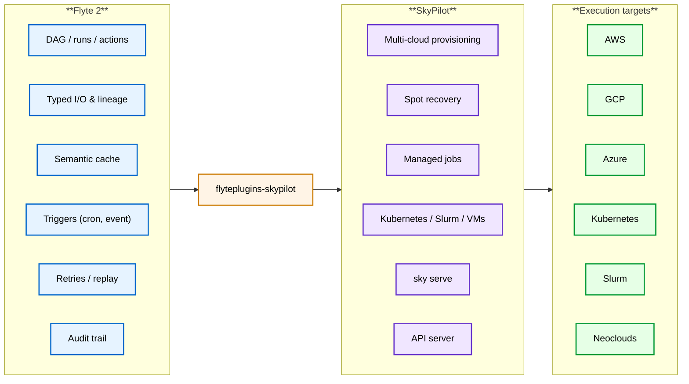
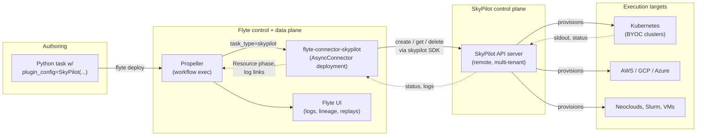
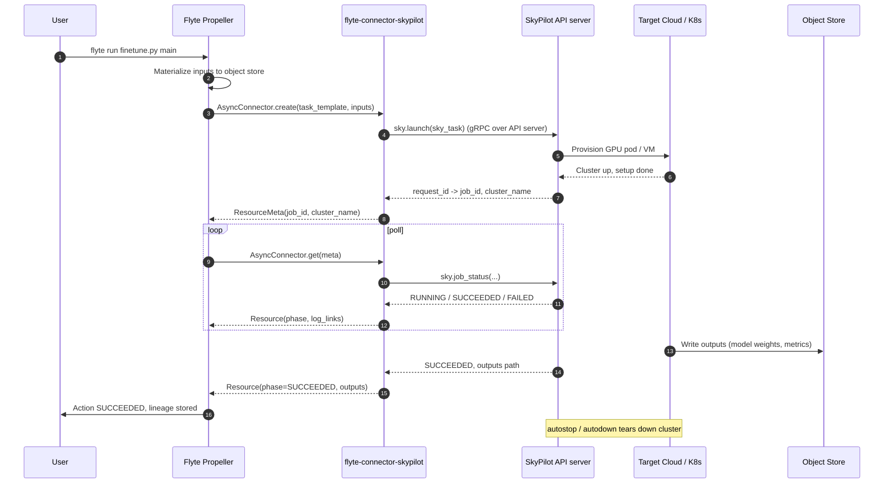
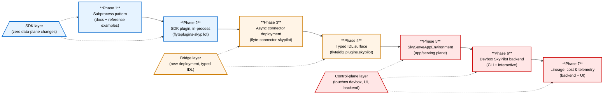

# Flyte 2 ↔ SkyPilot Integration Spec

**Status:** Draft for review
**Owners:** Flyte maintainers + Union GTM
**Audience:** Flyte maintainer team (engineering & PM) and prospective Union customers evaluating a Flyte + SkyPilot stack
**Scope:** A first-class `flyteplugins-skypilot` package and the backend/runtime work required to support it
**Companion docs:** [SPEC.md](./SPEC.md), [COMPARISON.md](./COMPARISON.md)

---

## TL;DR

This spec proposes a new `flyteplugins-skypilot` package, a Flyte 2 plugin that lets users target [SkyPilot](https://docs.skypilot.co/) as a compute backend from within a normal Flyte task or app. The integration follows the same SDK conventions already used by `flyteplugins.ray`, `flyteplugins.databricks`, and `flyteplugins.vllm`:

- A `SkyPilot` dataclass passed as `plugin_config=` to `flyte.TaskEnvironment` for one-shot tasks.
- A `SkyPilotJob` subclass for managed jobs (spot recovery, multi-region failover).
- A `SkyPilotConnector` that drives the SkyPilot API server via gRPC/REST and reports state back to Flyte.
- A `SkyServeAppEnvironment` for long-running services, mirroring `VLLMAppEnvironment` and `SGLangAppEnvironment`.

The plugin lets Flyte serve as the durable, lineage-aware control plane for pipelines that need SkyPilot's multi-cloud / multi-cluster reach, spot recovery, and "SSH-into-a-machine" iteration ergonomics — without forcing users to drop into raw `sky launch` or YAML.

---

## Quickstart

What this looks like to the user. A spot-aware, multi-region GPU job — cron-triggered, retried, with full Flyte lineage — written as one Python file:

```bash
uv pip install flyteplugins-skypilot
```

The SDK integration would look like this:

```python
import flyte
from flyte import Image
from flyte.io import File
from flyteplugins.skypilot import SkyPilotJob

env = flyte.TaskEnvironment(
    name="batch_inference",
    image=Image.from_debian_base(name="scorer").with_pip_packages(
        "torch", "flyteplugins-skypilot",
    ),
    plugin_config=SkyPilotJob(
        accelerators="A100:1",
        use_spot=True,
        regions=["us-west-2", "eu-west-1", "ap-northeast-1"],
        job_recovery="EAGER_NEXT_REGION",
    ),
)


@env.task(
    retries=flyte.RetryStrategy(count=2),
    triggers=flyte.Trigger.cron("0 */6 * * *"),
)
async def batch_score(shard: File) -> File:
    from scorer import run
    return run(shard)
```

No `sky launch`, no YAML, no manual polling, no separate dashboard. The Flyte run UI shows one action; SkyPilot transparently bids on spot A100s across three regions and recovers on preemption. The full surface — one-shot tasks, managed jobs, and SkyServe apps — is in §3.

---

## Audience-specific summaries

### For Flyte maintainers

- **No new core concepts.** The plugin reuses `AsyncConnector`, `TaskPluginRegistry`, and `AppEnvironment` — the same primitives that already back Databricks, Ray, Dask, vLLM, etc. No backend protocol changes are required for the surface-layer phases.
- **Three surfaces, one package.** Following the convention of `flyteplugins-databricks` (config dataclass + connector + task template), we expose `SkyPilot`, `SkyPilotJob`, `SkyPilotConnector`, and `SkyServeAppEnvironment` from a single `flyteplugins-skypilot` distribution.
- **Connector deployment.** The connector runs as its own K8s deployment in the Flyte data plane (`flyte-connector-skypilot`) and talks to one or more SkyPilot API servers using a `SKYPILOT_API_SERVER_ENDPOINT` env var and a Flyte secret for the bearer token. Local execution works via `AsyncConnectorExecutorMixin`.
- **IDL surface.** The surface layer piggybacks on the existing connector custom-config dict. The bridge layer introduces a small `flyteidl2.plugins.skypilot` proto (`SkyPilotJob`, `SkyPilotServe`) so launch specs are typed end-to-end. See §8 for the full phasing.
- **Risk profile.** Bounded. We do not fork SkyPilot, we do not extend the propeller, and we never block the data plane on SkyPilot availability — the connector is the only failure boundary.

### For Flyte users

- **One pipeline, many clouds.** Use Flyte for what Flyte is good at — durable pipelines, typed data, lineage, retries, caching, triggers — and use SkyPilot for what it is good at — finding cheap or available GPU capacity across your clouds and your Kubernetes clusters. The integration means your team writes one Python task; the platform handles the rest.
- **No data-plane re-architecture.** SkyPilot tasks launched from Flyte show up in the same Flyte run UI, with the same logs, lineage, and replay story as any other task. You do not lose visibility when work runs off-cluster.
- **Spot-aware, multi-region, managed.** SkyPilot's spot-recovery and managed-job features are exposed natively: a `Trigger.cron(...)` ETL can drive a `SkyPilotJob(use_spot=True, regions=["us-west-2", "eu-west-1"])` and still appear as a single deterministic action in the Flyte history.
- **Buy vs. build.** Flyte ships the connector, its deployment chart, the IDL, the SDK, the examples, and the support contract. Users can self-host both Flyte and SkyPilot, or buy Union-hosted Flyte's control plane and bring their own SkyPilot API server.

---

## 1. Background and motivation

### 1.1 What SkyPilot does well

[SkyPilot](https://docs.skypilot.co/en/latest/docs/index.html) is a compute control plane for AI workloads. From an authoring perspective, a user writes a `sky.Task` (or YAML) describing `resources`, `setup`, and `run`, and SkyPilot:

- Provisions VMs or Kubernetes pods on any of 20+ supported clouds plus Kubernetes/Slurm.
- Bin-packs and auto-fails-over across regions, zones, and accelerator types until it finds capacity.
- Manages spot/preemptible recovery, autostop, and idle teardown.
- Exposes a centralized [API server](https://docs.skypilot.co/en/latest/reference/api-server/api-server.html) so teams can share clusters and a single dashboard.
- Provides `sky serve` for autoscaled HTTP services with replica management across clouds.

SkyPilot is *not* an orchestrator: it does not own DAGs, lineage, typed I/O, semantic caching, durable execution, triggers, or audit trails.

### 1.2 Where Flyte 2 has gaps

In the FLYRES context (see [SPEC.md](./SPEC.md)), several requirements push beyond what stock Flyte 2 covers today:

- **Multi-cloud GPU scheduling.** Flyte schedules within a Kubernetes cluster (or cluster pool). It does not directly bid for spot capacity across AWS, GCP, and a neocloud and pick whichever is cheapest right now.
- **Multi-cluster Kubernetes.** Flyte cluster pools exist, but they are coarse-grained. SkyPilot has a richer "try this cluster, fall back to that one" failover story.
- **SSH-style interactive iteration.** Flyte's devbox helps here, but researchers who already work in `sky launch ... && ssh mycluster` will not switch unless they can keep that ergonomic.

The proposed integration closes these gaps by delegating to SkyPilot for the launching and lifecycle of compute, while Flyte continues to own the pipeline, lineage, and durability layer.

### 1.3 Tool boundaries



Flyte owns the *what* (pipeline graph, data, lineage). SkyPilot owns the *where* (which cloud, which region, which accelerator). The plugin is the contract between them.

---

## 2. Architecture

### 2.1 Runtime topology



Key properties:

- **Single failure boundary.** Only `flyte-connector-skypilot` is on the path between Flyte and SkyPilot. The propeller never blocks on SkyPilot directly.
- **No data-plane changes.** The Flyte data plane sees these tasks as opaque async connector tasks. Logs and dashboard links are surfaced through `TaskLog` entries, identical to how Databricks links the Databricks console.
- **Storage stays in Flyte.** Inputs are materialized via Flyte's `RawDataPath`; outputs are written to the same object store. SkyPilot's `file_mounts` are an optional optimization, not the data path.

### 2.2 SDK module layout

The package follows the standard `flyteplugins-<name>` convention:

```
plugins/skypilot/
├── README.md
├── pyproject.toml             # name = "flyteplugins-skypilot"
├── src/
│   └── flyteplugins/
│       └── skypilot/
│           ├── __init__.py    # public exports
│           ├── task.py        # SkyPilot / SkyPilotJob config + TaskTemplate
│           ├── connector.py   # SkyPilotConnector(AsyncConnector)
│           ├── app.py         # SkyServeAppEnvironment
│           ├── _models.py     # internal dataclasses (Resources, FileMount, etc.)
│           └── _idl.py        # proto wrappers (added in the bridge layer)
└── tests/
```

This is byte-for-byte the same layout as `plugins/databricks/`, `plugins/ray/`, and `plugins/vllm/`.

---

## 3. SDK API design

Every surface below is designed to mirror an existing plugin convention so that users and maintainers do not need a new mental model.

### 3.1 `SkyPilot` — task plugin config (Ray/Dask convention)

Pattern: a `@dataclass` config attached to a `TaskEnvironment` via `plugin_config=`. This is the same shape as `Dask`, `RayJobConfig`, `Spark`, and `Databricks`.

```python
# flyteplugins/skypilot/task.py (excerpt)
from dataclasses import dataclass, field
from typing import Dict, List, Optional, Union

import flyte
from flyte import Resources, Secret


@dataclass
class FileMount:
    """A SkyPilot file_mount entry. Mirrors the YAML schema."""
    target: str
    source: Optional[str] = None        # local path, s3://, gs://
    mode: Optional[str] = None          # "MOUNT", "COPY", "MOUNT_CACHED"


@dataclass
class SkyPilot:
    """
    Configuration for running a Flyte task on infrastructure provisioned by SkyPilot.

    Tasks in an environment with this plugin_config are launched as SkyPilot
    tasks via the configured SkyPilot API server. SkyPilot handles provisioning,
    setup, and teardown; Flyte handles inputs, outputs, lineage, and retries.

    Attributes:
        accelerators: e.g. "H100:8" or ["H100:8", "A100:8"] for failover.
        infra: SkyPilot infra spec, e.g. "k8s", "aws/us-east-1", "k8s/coreweave".
        cpus: CPU request, e.g. "4+".
        memory: Memory in GB, e.g. "32+".
        use_spot: Whether to bid for spot/preemptible capacity.
        regions: Optional ordered list of regions for failover.
        max_hourly_cost: Cap on hourly price (USD) when selecting infra.
        cluster_name: Reuse an existing SkyPilot cluster by name.
        autostop: Idle minutes before auto-stop; True for default (5 min).
        setup: Shell setup commands run once per cluster.
        run: Shell run commands. If None, the Flyte task entrypoint is used.
        file_mounts: List of FileMount entries.
        envs: Environment variables forwarded to the task.
        secrets: Flyte secrets injected into the SkyPilot task environment.
        api_server_endpoint: Overrides the connector default.
    """
    accelerators: Optional[Union[str, List[str]]] = None
    infra: Optional[str] = None
    cpus: Optional[str] = None
    memory: Optional[str] = None
    use_spot: bool = False
    regions: Optional[List[str]] = None
    max_hourly_cost: Optional[float] = None
    cluster_name: Optional[str] = None
    autostop: Union[bool, int, str, None] = True
    setup: Optional[str] = None
    run: Optional[str] = None
    file_mounts: List[FileMount] = field(default_factory=list)
    envs: Optional[Dict[str, str]] = None
    secrets: Optional[List[Secret]] = None
    api_server_endpoint: Optional[str] = None
```

**Why this shape.** It is identical in spirit to `RayJobConfig` and `Databricks`: a flat dataclass that maps directly to the upstream tool's first-class concepts (in this case the [SkyPilot YAML spec](https://docs.skypilot.co/en/latest/reference/yaml-spec.html)).

**Registration.** Following Ray/Dask:

```python
# flyteplugins/skypilot/task.py (continued)
from flyte.connectors import AsyncConnectorExecutorMixin
from flyte.extend import AsyncFunctionTaskTemplate, TaskPluginRegistry


@dataclass(kw_only=True)
class SkyPilotTask(AsyncConnectorExecutorMixin, AsyncFunctionTaskTemplate):
    plugin_config: SkyPilot
    task_type: str = "skypilot"

    def custom_config(self, sctx):
        # Serialize SkyPilot dataclass -> dict; the connector reconstitutes it
        # into a sky.Task at create() time. See _models.py for the round-trip.
        return _serialize_skypilot(self.plugin_config, sctx)


TaskPluginRegistry.register(SkyPilot, SkyPilotTask)
```

`AsyncConnectorExecutorMixin` is the same mixin used by Databricks; it provides the local-execution simulation so users can run a SkyPilot task locally during development.

#### Author-side usage

```python
import flyte
from flyte import Image, Secret
from flyteplugins.skypilot import SkyPilot

image = (
    Image.from_debian_base(name="trainer")
    .with_pip_packages("torch", "transformers", "flyteplugins-skypilot")
)

env = flyte.TaskEnvironment(
    name="train_env",
    image=image,
    plugin_config=SkyPilot(
        accelerators="H100:8",
        infra="k8s/coreweave",
        use_spot=True,
        regions=["us-west-2", "eu-west-1"],
        autostop=10,
        secrets=[Secret(key="HF_TOKEN", group="hf")],
    ),
)


@env.task
async def finetune(dataset: flyte.io.Dir, epochs: int = 3) -> flyte.io.Dir:
    # Body runs *inside* the SkyPilot-provisioned environment. SkyPilot's
    # `setup`/`run` are inferred from the Flyte task entrypoint; users only
    # set them explicitly when they need shell-level customization.
    from train import train_model
    return train_model(dataset, epochs=epochs)
```

That is the entire authoring surface for a one-shot SkyPilot task. There is no `sky launch`, no YAML, no manual polling.

### 3.2 `SkyPilotJob` — managed jobs subclass (Databricks-of-Spark convention)

Just like `Databricks(Spark)` extends `Spark` with cluster-specific fields, `SkyPilotJob(SkyPilot)` extends `SkyPilot` with the additional fields that the [managed jobs API](https://docs.skypilot.co/en/latest/reference/api.html) takes. This communicates to users: "you're doing the same thing, but with auto-recovery."

```python
@dataclass
class SkyPilotJob(SkyPilot):
    """
    Configuration for a SkyPilot *managed job*.

    Managed jobs are auto-restarted on spot preemption and can fail over
    across infra. Use this for long-running batch work where the cost
    of restart is bounded.

    Additional attributes:
        job_recovery: SkyPilot recovery strategy, e.g. "EAGER_NEXT_REGION".
        max_restarts_on_errors: How many times to retry on user errors.
        priority: Job priority (0..1000) within the API server queue.
        detach_run: Whether to return immediately after submission.
    """
    job_recovery: str = "EAGER_NEXT_REGION"
    max_restarts_on_errors: int = 0
    priority: int = 100
    detach_run: bool = True


TaskPluginRegistry.register(SkyPilotJob, SkyPilotJobTask)  # subclass routing
```

Authoring:

```python
env = flyte.TaskEnvironment(
    name="batch_inference",
    image=image,
    plugin_config=SkyPilotJob(
        accelerators="A100:1",
        use_spot=True,
        regions=["us-west-2", "eu-west-1", "ap-northeast-1"],
        job_recovery="EAGER_NEXT_REGION",
        max_restarts_on_errors=3,
    ),
)


@env.task(
    retries=flyte.RetryStrategy(count=2),
    triggers=flyte.Trigger.cron("0 */6 * * *"),
)
async def batch_score(shard: flyte.io.File) -> flyte.io.File:
    ...
```

### 3.3 `SkyPilotConnector` — the async connector (Databricks/BigQuery convention)

This is the heart of the integration. It implements `AsyncConnector` (the same interface used by `DatabricksConnector` and `BigQueryConnector`) and talks to SkyPilot via its Python SDK.

```python
# flyteplugins/skypilot/connector.py (sketch)
import os
from dataclasses import dataclass
from typing import Any, Dict, Optional

import sky
from flyte import logger
from flyte.connectors import (
    AsyncConnector,
    ConnectorRegistry,
    Resource,
    ResourceMeta,
)
from flyte.connectors.utils import convert_to_flyte_phase
from flyteidl2.core.execution_pb2 import TaskExecution, TaskLog
from flyteidl2.core.tasks_pb2 import TaskTemplate


@dataclass
class SkyPilotJobMetadata(ResourceMeta):
    api_server: str
    cluster_name: Optional[str]   # for one-shot tasks
    job_id: int                   # SkyPilot job id
    managed: bool                 # True if launched via sky.jobs.launch


class SkyPilotConnector(AsyncConnector):
    name = "SkyPilot Connector"
    task_type_name = "skypilot"     # also handles "skypilot_job" via _task_type_versions
    metadata_type = SkyPilotJobMetadata

    async def create(
        self,
        task_template: TaskTemplate,
        inputs: Optional[Dict[str, Any]] = None,
        skypilot_token: Optional[str] = None,
        **kwargs,
    ) -> SkyPilotJobMetadata:
        spec = _deserialize_skypilot(task_template.custom)
        sky_task = _build_sky_task(spec, task_template, inputs)
        api_server = spec.api_server_endpoint or os.environ["SKYPILOT_API_SERVER_ENDPOINT"]
        sky.api.login(endpoint=api_server, token=skypilot_token)

        if task_template.type == "skypilot_job":
            request_id = sky.jobs.launch(sky_task, name=task_template.id.name)
            job_id, _ = sky.stream_and_get(request_id)
            return SkyPilotJobMetadata(api_server=api_server, cluster_name=None,
                                        job_id=job_id, managed=True)
        else:
            request_id = sky.launch(
                task=sky_task,
                cluster_name=spec.cluster_name or _autoname(task_template),
                detach_run=True,
            )
            job_id, handle = sky.stream_and_get(request_id)
            return SkyPilotJobMetadata(
                api_server=api_server,
                cluster_name=handle.get_cluster_name(),
                job_id=job_id,
                managed=False,
            )

    async def get(self, resource_meta: SkyPilotJobMetadata, **kwargs) -> Resource:
        if resource_meta.managed:
            status = sky.jobs.queue(job_ids=[resource_meta.job_id])[0]
        else:
            status = sky.job_status(resource_meta.cluster_name, [resource_meta.job_id])[
                resource_meta.job_id
            ]
        phase = convert_to_flyte_phase(_skypilot_status_to_string(status))
        log_link = TaskLog(
            uri=_dashboard_url(resource_meta),
            name="SkyPilot Dashboard",
            ready=True,
            link_type=TaskLog.DASHBOARD,
        )
        return Resource(phase=phase, message=str(status), log_links=[log_link])

    async def delete(self, resource_meta: SkyPilotJobMetadata, **kwargs):
        if resource_meta.managed:
            sky.jobs.cancel(job_ids=[resource_meta.job_id])
        elif resource_meta.cluster_name:
            sky.cancel(resource_meta.cluster_name, job_ids=[resource_meta.job_id])

    async def get_logs(self, resource_meta, token: str = "", **kwargs):
        # Stream SkyPilot logs page-by-page using sky.tail_logs(follow=False)
        async for page in _paginate_logs(resource_meta, token):
            yield page


ConnectorRegistry.register(SkyPilotConnector())
```

The shape — `create / get / delete / get_logs` — is exactly the contract Flyte 2 already defines for [connectors](https://www.union.ai/docs/v2/flyte/integrations/) and is the same one Databricks uses today.

### 3.4 `SkyServeAppEnvironment` — long-running services (vLLM/SGLang convention)

For services (model endpoints, web apps), follow the convention set by `VLLMAppEnvironment` and `SGLangAppEnvironment`: a subclass of `flyte.app.AppEnvironment` whose `__post_init__` wires the right `setup`/`run` commands and forwards to `sky serve up` rather than running in-cluster.

```python
# flyteplugins/skypilot/app.py
from dataclasses import dataclass, field
from typing import Dict, List, Optional

import flyte.app
from flyte import Image, Resources, Secret


@dataclass(kw_only=True)
class SkyServeAppEnvironment(flyte.app.AppEnvironment):
    """
    Deploy a Flyte app as a SkyPilot service (`sky serve`).

    SkyServe handles cross-cloud replica placement, autoscaling, and load
    balancing; Flyte handles app definition, secrets, and the URL surface
    visible in the Flyte UI.

    Attributes:
        replicas: Replica count or autoscaler config (min, max, qps target).
        accelerators: Per-replica accelerator spec (e.g. "H100:1").
        infra: SkyPilot infra string (multi-cloud-aware).
        readiness_probe: Path or full probe config.
    """
    replicas: int | "Autoscaling" = 2
    accelerators: Optional[str] = None
    infra: Optional[str] = None
    readiness_probe: str = "/health"
    sky_setup: Optional[str] = None
    sky_run: Optional[str] = None
```

Authoring (lifted directly from the vLLM convention):

```python
from flyteplugins.skypilot import SkyServeAppEnvironment

app_env = SkyServeAppEnvironment(
    name="customer-llm",
    image=image,
    accelerators="H100:1",
    infra="k8s/coreweave",
    replicas=flyte.Autoscaling(min=2, max=8, target_qps=20),
    secrets=[Secret(key="HF_TOKEN", group="hf")],
    sky_run="vllm serve meta-llama/Meta-Llama-3.1-8B --port 8000",
    port=8000,
)
```

`flyte deploy` registers the app; the connector calls `sky.serve.up(...)` and pins the resulting URL into the Flyte app's `Link`. From the operator's standpoint, this is the same flow as deploying a vLLM app today.

### 3.5 Public exports

```python
# flyteplugins/skypilot/__init__.py
from flyteplugins.skypilot.app import SkyServeAppEnvironment
from flyteplugins.skypilot.connector import SkyPilotConnector
from flyteplugins.skypilot.task import FileMount, SkyPilot, SkyPilotJob

__all__ = [
    "FileMount",
    "SkyPilot",
    "SkyPilotJob",
    "SkyPilotConnector",
    "SkyServeAppEnvironment",
]
```

---

## 4. Capability mapping

A direct cross-reference. Anything in the left column maps to the right column 1:1; new authoring surface is intentionally minimal.

| Flyte 2 concept                          | SkyPilot concept                                                       | How the plugin handles it                                          |
|------------------------------------------|------------------------------------------------------------------------|--------------------------------------------------------------------|
| `TaskEnvironment(plugin_config=SkyPilot)`| `sky.Task(resources=...)`                                              | Connector translates dataclass → `sky.Task` in `create()`          |
| `Resources(gpu="H100:8")`                | `accelerators="H100:8"`                                                | Auto-derived from `plugin_config.accelerators`                     |
| `flyte.io.File` / `flyte.io.Dir` input   | Object-store URI                                                       | Materialized via Flyte; no SkyPilot `file_mount` needed by default |
| `Secret(key=..., group=...)`             | `secrets:` block / env vars                                            | Connector injects via SkyPilot `envs`                              |
| `Trigger.cron(...)`                      | (n/a)                                                                  | Flyte schedules; each fire creates a fresh SkyPilot task           |
| `RetryStrategy`                          | `max_restarts_on_errors`                                               | Flyte handles outer retry; managed job handles inner               |
| `cache="auto"`                           | (n/a)                                                                  | Flyte's semantic cache short-circuits before SkyPilot is called    |
| `Action.logs` / Flyte UI                 | `sky dashboard`, `sky logs`                                            | `get_logs()` streams SkyPilot logs into Flyte UI                   |
| `flyte.deploy()` on an `AppEnvironment`  | `sky serve up`                                                         | `SkyServeAppEnvironment` connector calls `sky.serve.up`            |
| Devbox (`flyte.with_runcontext`)         | `ssh mycluster` / SkyPilot pods                                        | Control-plane layer: Flyte devbox can opt into a SkyPilot-managed pod |

---

## 5. Execution lifecycle



The shape is identical to the existing Databricks lifecycle; only the verbs (`sky.launch` vs. `runs/submit`) differ.

---

## 6. Worked end-to-end example

Below is a full pipeline using the proposed API. It mirrors the structure of `examples/reference_stacks/flyres_stack/08_end_to_end_ml_pipeline.py` so a maintainer can do a side-by-side review against current conventions.

```python
import flyte
from flyte import Image, Resources, Secret
from flyte.io import Dir, File
from flyteplugins.skypilot import SkyPilot, SkyPilotJob, SkyServeAppEnvironment


image = (
    Image.from_debian_base(name="flyres", python_version=(3, 12))
    .with_pip_packages("torch", "transformers", "datasets", "flyteplugins-skypilot")
)

prep_env = flyte.TaskEnvironment(
    name="prep_env",
    image=image,
    resources=Resources(cpu="8", memory="32Gi"),
)

train_env = flyte.TaskEnvironment(
    name="train_env",
    image=image,
    plugin_config=SkyPilot(
        accelerators="H100:8",
        infra="k8s/coreweave",
        use_spot=True,
        regions=["us-west-2", "eu-west-1"],
        autostop=15,
        secrets=[Secret(key="HF_TOKEN", group="hf")],
    ),
)

eval_env = flyte.TaskEnvironment(
    name="eval_env",
    image=image,
    plugin_config=SkyPilotJob(
        accelerators="A100:1",
        use_spot=True,
        regions=["us-west-2", "eu-west-1", "ap-northeast-1"],
        job_recovery="EAGER_NEXT_REGION",
        max_restarts_on_errors=3,
    ),
)

serve_env = SkyServeAppEnvironment(
    name="customer-llm",
    image=image,
    accelerators="H100:1",
    infra="k8s/coreweave",
    replicas=flyte.Autoscaling(min=2, max=8, target_qps=25),
    secrets=[Secret(key="HF_TOKEN", group="hf")],
    sky_run="vllm serve $MODEL_PATH --port 8000",
    port=8000,
)


@prep_env.task(cache="auto")
async def prepare(raw: Dir) -> Dir:
    ...


@train_env.task(retries=flyte.RetryStrategy(count=2))
async def finetune(dataset: Dir, epochs: int) -> Dir:
    ...


@eval_env.task
async def evaluate(weights: Dir, eval_set: Dir) -> File:
    ...


@prep_env.task(
    triggers=flyte.Trigger.cron("0 2 * * *", timezone="UTC"),
)
async def main(raw: Dir, eval_set: Dir) -> File:
    dataset = await prepare(raw)
    weights = await finetune(dataset, epochs=3)
    report = await evaluate(weights, eval_set)
    return report


if __name__ == "__main__":
    flyte.init_from_config()
    flyte.deploy(main, serve_env)
```

What this buys the user, end-to-end:

- `prepare` runs in the local cluster pool (no SkyPilot).
- `finetune` is launched on SkyPilot, on spot H100s, across two regions, with code synced from the Flyte code bundle.
- `evaluate` is a SkyPilot *managed job*: if it gets preempted, SkyPilot eagerly retries in the next region without Flyte intervention.
- `serve_env` is deployed via `sky serve` and surfaces a single auth-protected URL in the Flyte app dashboard.
- The whole pipeline is one cron-triggered Flyte run, with one lineage graph and one audit trail.

---

## 7. Implementation details for maintainers

Each subsection below maps to a phase in §8. The intent is to keep the implementation per phase narrow enough that any phase can be reviewed, merged, and shipped as an independent unit.

### 7.1 Surface layer (phases 1–2)

- **Phase 1 — subprocess pattern.** Documentation and reference examples only. No new code in `plugins/`. Users wrap `sky launch` from a normal Flyte task using `flyte.extras.ContainerTask` or a shell-out. This exists to validate demand and surface authoring frictions.
- **Phase 2 — in-process SDK plugin.** `flyteplugins-skypilot` ships with the `SkyPilot` / `SkyPilotJob` dataclasses and a `SkyPilotTask` that calls the SkyPilot Python SDK in-process from the user's task pod. Reuses the existing connector custom-config dict; no IDL changes. `AsyncConnectorExecutorMixin` keeps `flyte run --local` working. No new deployments — the user's container ships `skypilot` and the API server endpoint comes from a task env var or secret.

### 7.2 Bridge layer (phases 3–4)

- **Phase 3 — async connector deployment.** Promote SkyPilot to a true async connector. One new K8s deployment (`flyte-connector-skypilot`) added to the Helm chart's `connectors` map. Centralizes credentials, isolates failure boundaries, and removes the dependency on every user image carrying `skypilot`.
- **Phase 4 — typed IDL.** Add `flyteidl2/plugins/skypilot.proto` with `SkyPilotJob` and `SkyPilotServe` messages so launch specs are typed end-to-end. Generate Python stubs in `flyteplugins-skypilot`; switch `custom_config` from `MessageToDict(dict)` to `MessageToDict(SkyPilotJob(...))` — same pattern as `flyteidl2.plugins.spark_pb2` used by Spark and Databricks.

### 7.3 Control-plane layer (phases 5–7)

- **Phase 5 — `SkyServeAppEnvironment`.** Integrate `sky serve` with the Flyte app/serving lifecycle. Replica/autoscaling settings translate to SkyServe's replica config. `flyte deploy` registers the app, the connector calls `sky.serve.up(...)`, and the resulting URL is pinned into the Flyte app's `Link`.
- **Phase 6 — devbox SkyPilot backend.** `flyte devbox launch --plugin skypilot --accelerators H100:8` ssh-tunnels into a SkyPilot-provisioned pod. The Flyte CLI uses the connector to call `sky.launch(... cluster_name=devbox-<user>-<id>)`, then opens an SSH tunnel. This closes the "honest tension" called out in [SPEC.md](./SPEC.md) without rebuilding SkyPilot's strengths.
- **Phase 7 — lineage, cost, and telemetry.** Surface SkyPilot cost telemetry, spot-recovery events, and multi-cluster routing decisions in the Flyte UI and run graph. Optional control-plane affinity (mapping Flyte queues to SkyPilot priorities). Touches backend and UI; intentionally last.

### 7.4 Dependencies

```toml
# plugins/skypilot/pyproject.toml
[project]
name = "flyteplugins-skypilot"
dynamic = ["version"]
description = "SkyPilot plugin for Flyte 2"
readme = "README.md"
requires-python = ">=3.10"
dependencies = [
    "flyte",
    "skypilot>=0.7.0",
]

[project.optional-dependencies]
aws    = ["skypilot[aws]>=0.7.0"]
gcp    = ["skypilot[gcp]>=0.7.0"]
azure  = ["skypilot[azure]>=0.7.0"]
k8s    = ["skypilot[kubernetes]>=0.7.0"]
all    = ["skypilot[all]>=0.7.0"]
```

### 7.5 Auth and secrets

- The connector reads two values at startup:
  - `SKYPILOT_API_SERVER_ENDPOINT` (env var, set on the connector deployment).
  - `skypilot_token` (Flyte secret, injected at connect time via `Secret(key="skypilot_token")`).
- Per-task overrides live on the `SkyPilot` dataclass (`api_server_endpoint`) — useful for customers running per-team SkyPilot API servers.
- Cloud credentials (AWS, GCP keys, kube configs) are owned by SkyPilot itself, not Flyte. Flyte never sees them.

### 7.6 Multi-tenancy

- Each Flyte project maps to a SkyPilot API server user via a configurable resolver in the connector. Default: one shared service account; opt-in: per-project tokens.
- Cluster naming is namespaced: `flyte-<project>-<domain>-<action_id>` to avoid collisions on a shared SkyPilot dashboard.

### 7.7 Failure modes & guardrails

| Failure                                  | Behavior                                                              |
|------------------------------------------|-----------------------------------------------------------------------|
| SkyPilot API server unreachable          | Connector returns `RUNNING` with backoff; surfaces `SkyDownError`     |
| Connector pod crash                      | K8s restarts; `get()` is idempotent so polling resumes from job_id    |
| Spot preemption (one-shot task)          | Connector reports `FAILED`; Flyte retry policy re-launches            |
| Spot preemption (managed job)            | SkyPilot recovers transparently; Flyte sees a single `RUNNING` window |
| Cloud quota exhaustion                   | SkyPilot fails over to next region/cloud; recorded in log links       |
| Long autostop after success              | Connector flips `phase=SUCCEEDED` immediately; teardown is async      |

---

## 8. Build phases

The work is organized as a progression from **surface-level integration** (SDK only, no new infra) to **deep control-plane integration** (devbox, UI, backend telemetry). Each phase is independently shippable, each de-risks the next, and each later phase can be deferred or skipped if the value proven by earlier phases does not warrant the investment.

### 8.1 Sequencing



### 8.2 What each phase ships, and why it sequences this way

| Phase | Layer          | Deliverable                                       | What gets de-risked for the next phase                                                                                                       | Effort |
|-------|----------------|---------------------------------------------------|----------------------------------------------------------------------------------------------------------------------------------------------|--------|
| 1     | SDK            | Reference examples showing `sky launch` from a normal Flyte task using `flyte.extras.ContainerTask` or a shell-out. No new code in the SDK. | Validates the value proposition with design partners and surfaces real authoring frictions before any plugin code is committed. Lowest possible commitment. | S      |
| 2     | SDK            | `flyteplugins-skypilot` with `SkyPilot` / `SkyPilotJob` dataclasses and `SkyPilotTask`, running the SkyPilot Python SDK **in-process** from the user's task pod (via `AsyncConnectorExecutorMixin`). | Locks in the dataclass shape, the `sky.Task` round-trip serialization, secrets injection, and the authoring ergonomics — *without* committing to a new deployment topology yet. | M      |
| 3     | Bridge         | Promote SkyPilot to a true async connector with its own K8s deployment (`flyte-connector-skypilot`), matching the Databricks/BigQuery topology. | Decouples failure boundaries, centralizes credentials, removes the "every task pod ships SkyPilot" cost, and proves the connector can scale under fanout. | M      |
| 4     | Bridge         | `flyteidl2.plugins.skypilot` proto so launch specs are typed end-to-end; the connector starts consuming the proto instead of an untyped dict. | Gives the backend a stable schema to introspect, which is a prerequisite for any UI surfacing of SkyPilot intent in later phases.            | S      |
| 5     | Control plane  | `SkyServeAppEnvironment` integrated with the Flyte app/serving lifecycle, including replica/autoscaling translation. | First control-plane-aware surface. Validates that app deployment and the connector can co-exist before we touch devbox or telemetry.        | M      |
| 6     | Control plane  | `flyte devbox launch --plugin skypilot ...` boots a SkyPilot-managed pod; CLI handles SSH tunnel, code sync, and teardown. | Most invasive CLI/handoff work; intentionally gated on phases 2–5 because it cuts across SDK, connector, and developer tooling.              | L      |
| 7     | Control plane  | Cost, spot-recovery, and multi-cluster routing telemetry rendered in the Flyte UI and run graph. Optional control-plane affinity (Flyte queue ↔ SkyPilot priority). | Pure deepening: requires every prior phase. Defer until adoption justifies the UI/backend investment.                                        | L      |

Effort uses T-shirt sizing (S ≈ ~2 eng-weeks, M ≈ ~8 eng-weeks, L ≈ ~16 eng-weeks). Each phase has its own GA gate; we explicitly do not pre-commit to phases 5–7 until phases 2–3 ship and design-partner usage justifies the deeper investment.

### 8.3 Decision points between phases

- **After phase 1.** Did at least two design partners adopt the subprocess pattern in their pipelines? If no, the integration is not pulled in by enough demand to justify continuing.
- **After phase 2.** Does the in-process SDK feel right ergonomically? Are users hitting the failure modes that a dedicated connector deployment would fix? If yes, proceed to phase 3.
- **After phase 4.** Is the typed IDL stable, and does the connector deployment hold up under realistic load? Phases 5–7 are gated on a yes here.
- **Before phase 6.** Is devbox usage on Flyte already growing? Devbox is the most invasive surface and should only be tackled when there is a clear pull from researchers asking for SkyPilot-style interactivity.

This gating is the explicit answer to "how do we de-risk deeper engineering work": **each phase is shippable, each phase is gated on validation from the prior phase, and the deepest control-plane work is intentionally the last thing we commit to.**

---

## 9. Risks & open questions

### 9.1 Maintainer-side risks

- **SkyPilot SDK churn.** SkyPilot ships frequently and has occasionally renamed Python APIs. Mitigation: pin to a tested minor range, vendor the small subset we depend on into a thin adapter in `_models.py`, and run a daily integration test against SkyPilot's `latest`.
- **Connector deployment scaling.** Long-running pollers can hog the connector pod under heavy fanout. Mitigation: switch the SkyPilot connector to event-driven polling (use SkyPilot's webhook/event API once it stabilizes) before we encourage 1000-fanout patterns.
- **Code-bundle vs `workdir` divergence.** Flyte ships code via the code bundle; SkyPilot ships code via `workdir`. We must pick one as authoritative and document the contract. Default: use the Flyte code bundle, copy it into the SkyPilot setup so `~/sky_workdir` matches what Flyte sees.
- **Cost attribution.** SkyPilot's API server emits cost telemetry; Flyte's UI does not currently render it. Mitigation: surface it as `Link` outputs in the surface/bridge layers, build dedicated UI in the control-plane layer.

### 9.2 Customer-side open questions

1. Does the customer want a **single SkyPilot API server** shared across teams, or **per-team API servers**? This shapes the auth model and pricing.
2. Are they comfortable with **two control planes** (Flyte + SkyPilot API server) at the operational level, or do they need Union to host SkyPilot for them too?
3. Where is the **billing accountability** going to live — Union for Flyte, the customer's cloud bill for SkyPilot-provisioned compute, or a Union-managed multi-cloud aggregator? (See §10.)
4. How aggressive is their spot-vs-on-demand budget? This determines the default of `use_spot` and the recommended `job_recovery` strategy in our examples.

---

## 10. GTM and customer-facing positioning (Union)

### 10.1 Where this lands in the deal motion

This integration unlocks a specific buyer profile that today either (a) buys SkyPilot and builds their own DAG layer, or (b) buys Flyte/Union and writes a SkyPilot subprocess in a Python task. Both are tells: the buyer has multi-cloud GPU economics on their roadmap and is missing the pipeline durability layer.

**Ideal-fit prospect signals:**

- Already runs SkyPilot in dev/research, mentions it during discovery.
- Has GPU spend ≥ \$2M/yr and explicit spot/multi-region cost pressure.
- Has more than one Kubernetes cluster or more than one cloud account for GPU.
- Has a "model factory" pattern: continuous fine-tune → eval → deploy.
- Currently uses Argo / Airflow / hand-rolled Python to glue SkyPilot together.

For each of these, the integration converts a "Flyte vs. SkyPilot" comparison into a "Flyte + SkyPilot, sold by Union" expansion.

### 10.2 Value-prop framing

When pitching to a prospect that already runs SkyPilot:

> *"Keep SkyPilot for what it does best — finding cheap, available GPUs across your clouds. Add Flyte 2 (sold and supported by Union) on top to get the durable pipelines, lineage, and triggers that SkyPilot deliberately does not provide. Same Python authoring experience, no rewrite, and your existing SkyPilot YAML still works underneath."*

When pitching to a prospect that already runs Flyte / Union:

> *"You already have the pipeline, lineage, and trigger layer. The SkyPilot plugin lets that pipeline reach across regions and clouds for spot capacity without you giving up the audit trail. Tasks that today must run in your home cluster can now bid for capacity wherever it is cheapest, with the same Python code."*

### 10.3 Pricing implications

- **Plugin itself is OSS** (Apache 2.0, in the `flyte-sdk` monorepo) — consistent with all `flyteplugins-*` packages today.
- **Hosted SkyPilot API server** is a candidate Union add-on SKU. Customers who do not want to operate their own API server can pay Union to host it; we already operate one for our managed devbox.
- **Multi-cloud cost dashboards** (control-plane-layer UI work) are a natural Union-only feature, in the same way Union Queues are today.
- **Support contract scope** explicitly covers the connector, the IDL, the SDK package, and "best-effort triage" of upstream SkyPilot issues. Upstream fixes go through the SkyPilot OSS project.

### 10.4 Competitive positioning

| Competitor                       | Why our integration wins                                                                                        |
|----------------------------------|-----------------------------------------------------------------------------------------------------------------|
| Anyscale (Ray + serve)           | Single-runtime lock-in. Flyte + SkyPilot keeps Ray, Spark, vLLM, and anything else on equal footing.            |
| Domino / Coiled / standalone Sky | No durable pipeline layer; no lineage. We bring that without forcing the customer off their existing tools.     |
| Pure Argo + Sky subprocess       | No typed I/O, no caching, no semantic replay. The connector pattern makes those first-class.                    |
| Pure Flyte today                 | No multi-cloud failover, no spot-recovery, no `sky serve`. The plugin closes those gaps without core rewrites.  |

### 10.5 Reference customer story (template)

> *"\<Customer\> runs distributed pretraining on H100s across three clouds. Before adopting Flyte + SkyPilot, their team ran SkyPilot jobs from a hand-rolled Argo workflow and spent ~20% of researcher time debugging spot preemptions and missing lineage. After moving to the `flyteplugins-skypilot` integration: spot preemption is invisible to authors (handled by `SkyPilotJob`), every training run has a typed lineage record in Flyte, and the team consolidated four orchestrators into one. Total infra spend dropped 31% via aggressive spot adoption, while pipeline reliability improved (SLO from 92% → 99%)."*

---

## 11. Appendix

### 11.1 Conformance with existing plugin conventions

| Convention                                                  | Where                                            | This plugin                                  |
|-------------------------------------------------------------|--------------------------------------------------|----------------------------------------------|
| Package name `flyteplugins-<name>`                          | `plugins/dask/pyproject.toml`                    | `flyteplugins-skypilot`                      |
| Public exports via `__init__.py`                            | `plugins/ray/src/flyteplugins/ray/__init__.py`   | `SkyPilot`, `SkyPilotJob`, `SkyPilotConnector`, `SkyServeAppEnvironment` |
| `@dataclass` config passed via `plugin_config=`             | `flyteplugins.dask.Dask`                         | `flyteplugins.skypilot.SkyPilot`             |
| Subclass for richer variant                                 | `Databricks(Spark)`                              | `SkyPilotJob(SkyPilot)`                      |
| `AsyncConnector` + `ConnectorRegistry.register(...)`        | `flyteplugins.databricks.DatabricksConnector`    | `flyteplugins.skypilot.SkyPilotConnector`    |
| `AsyncConnectorExecutorMixin` for local exec                | `flyteplugins.databricks.DatabricksFunctionTask` | `flyteplugins.skypilot.SkyPilotTask`         |
| `AppEnvironment` subclass for services                      | `flyteplugins.vllm.VLLMAppEnvironment`           | `flyteplugins.skypilot.SkyServeAppEnvironment`|
| `flyteidl2.plugins.<name>_pb2` for typed custom-config      | `flyteidl2.plugins.spark_pb2`                    | `flyteidl2.plugins.skypilot_pb2` (bridge layer) |
| Connector secrets via `kubectl set env deployment/...`      | Connector docs in `integrations.md`              | `SKYPILOT_API_SERVER_ENDPOINT`, `skypilot_token` |

### 11.2 References

- SkyPilot docs: <https://docs.skypilot.co/en/latest/docs/index.html>
- SkyPilot YAML spec: <https://docs.skypilot.co/en/latest/reference/yaml-spec.html>
- SkyPilot API server: <https://docs.skypilot.co/en/latest/reference/api-server/api-server.html>
- Flyte 2 user guide: <https://www.union.ai/docs/v2/flyte/user-guide/>
- Flyte 2 integrations: <https://www.union.ai/docs/v2/flyte/integrations/>
- Flyte 2 plugin source: <https://github.com/flyteorg/flyte-sdk/tree/main/plugins>
- Companion specs: [`SPEC.md`](./SPEC.md) (FLYRES stack), [`COMPARISON.md`](./COMPARISON.md) (Flyte vs Dagster)

### 11.3 Out of scope (explicitly deferred)

- Rewriting SkyPilot's API server in Go to embed it in the Flyte data plane. Not necessary; not aligned with the connector pattern.
- Cost-based scheduling decisions made by Flyte (vs. SkyPilot). SkyPilot owns the bidder; Flyte owns the trigger.
- Slurm-as-target. SkyPilot supports it; we will validate but not productize until a design partner requests it.
- Ray-on-SkyPilot composition (`flyteplugins.ray` + `flyteplugins.skypilot` on the same task). Possible but a phase-4 conversation.

